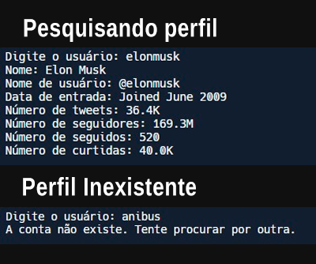

**Twitter Data Extraction Script**

Este script foi desenvolvido para extrair informações de perfis do Twitter, utilizando como base o site [Twstalker](https://twstalker.com/).

[]([https://github.com/kensdy/Twitter-Data-Extraction](https://github.com/kensdy/Twitter-Data-Extraction))

### Dados Extraídos:

- **Nome:**
- **Nome de Usuário:**
- **Data de Entrada:**
- **Número de Tweets:**
- **Número de Seguidores:**
- **Número de Seguidos:**
- **Número de Curtidas:**

### Como Usar:

1. Clone o repositório:

   ```bash
   git clone https://github.com/kensdy/Twitter-Data-Extraction.git
   ```

2. Instale as dependências:

   ```bash
   pip install -r requirements.txt
   ```

3. Execute o script principal:

   ```bash
   python main_pt.py
   ```

### Capturas de Tela:



### Demonstração em Vídeo

Assista a um vídeo demonstrativo do Script no YouTube:

[](https://www.youtube.com/watch?v=gjW5WG1_APw)

Instalando e rodando o código


### Colabore:

Se você encontrar problemas, ou deseja contribuir para a melhoria deste script, sinta-se à vontade para enviar pull requests. Toda contribuição é bem-vinda!

### Licença:

Este script é distribuído sob a [Licença GNU Affero General Public License](https://www.gnu.org/licenses/agpl-3.0.html). Leia a licença para entender os termos e condições detalhados.
